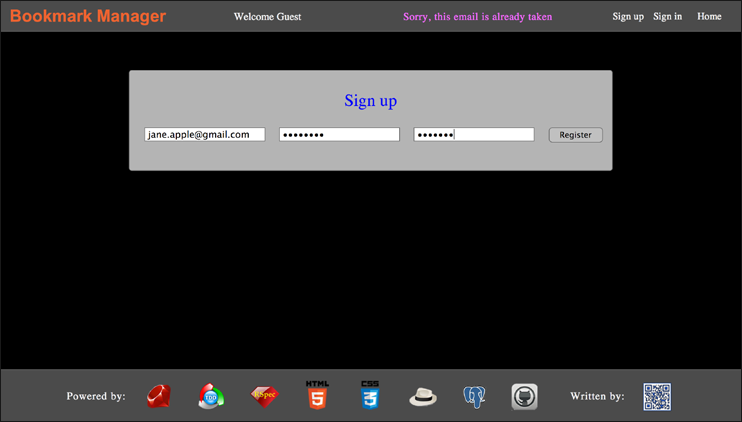
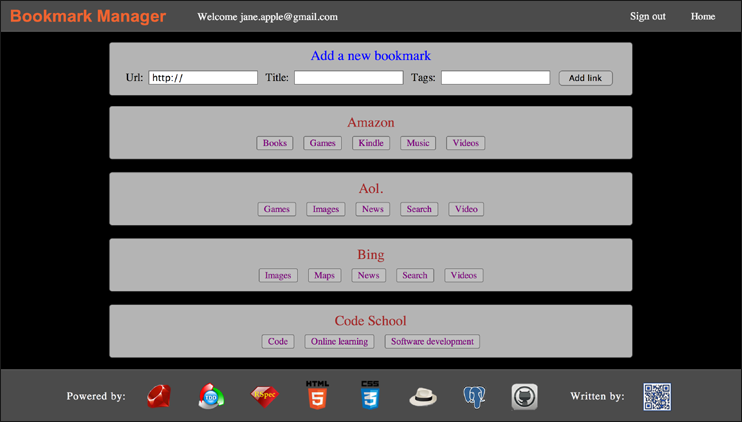

#Bookmark Manager 

[](https://codeclimate.com/github/nadavmatalon/bookmark-manager)

## Table of Contents

* [Screenshots](#screenshots)
* [General Description](#general-description)
* [See it Live on Heroku](#see-it-live-on-heroku)
* [How to install Locally](#how-to-install-locally)
* [Browser Compatibility](#browser-compatibility)
* [Testing](#testing)
* [License](#license)


##Screenshots

<table>
	<tr>
		<td align="center" width="190px" >
			<a href="https://raw.githubusercontent.com/nadavmatalon/bookmark-manager/master/public/images/app_screenshot_3.png">
				
				 Sign up
			</a>
		</td>
		<td align="center" width="190px" >
			<a href="https://raw.githubusercontent.com/nadavmatalon/bookmark-manager/master/public/images/app_screenshot_1.png">
				
				New bookmark
			</a>
		</td>
		<td align="center" width="190px" >
			<a href="https://raw.githubusercontent.com/nadavmatalon/bookmark-manager/master/public/images/app_screenshot_2.png">
				
				Browse bookmarks
			</a>
		</td>
	</tr>
</table>


##General Description

__Bookmark Manager__ is a [Sinatra](http://www.sinatrarb.com) web app 
written in [Ruby](https://www.ruby-lang.org/en/) (2.1.1) according to 
[TDD](http://en.wikipedia.org/wiki/Test-driven_development)
(testing done with [Rspec](http://rspec.info/) &amp; 
[Capybara](https://github.com/jnicklas/capybara)), 
during week 5 of the course at [Makers Academy](http://www.makersacademy.com/).

The app uses a [postgreSQL](http://www.postgresql.org) database to store data.

__Bookmark Manager__ enables users 
to create and save a list of links (or 'bookmarks') to various websites, 
as well as categorize and filter them via tags.

The [postgreSQL](http://www.postgresql.org) database holds the information needed for 
the user management interface (sign up, sign in and sign out). 
In this context, various validations have been put in place, e.g. 
verification of correct email format, email uniqueness, password length, and so forth.

The database also holds all the 'bookmarks' data (i.e. link-names, urls and tags). 

Registered users can add new bookmarks to the list, while un-registered users can only 
browse its corrent content.

When adding a new bookmark, the user is prompted to provide a url address, a title, as well as
optional tags for indexing purposes.

The list itself can be viewed in its entirety (the defualt), or it can be filtered according
to a specific tag. Both the list itself and the tags are ordered alphabetically.

In visual terms, the site includes a 'sticky' navigation bar at the top, and a 'sticky' footer at
the bottom.

Clicking on a particular tab in the list of bookmarks changes the view to show only 
bookmarks that share the selected tag.


##See it Live on Heroku

A live version of the app can be found at:

[Bookmark-Manager on Heroku](http://makers-bookmark-manager.herokuapp.com/)

As I'm using Heroku's free hosting service, the app may take a bit of time to upload  
(Heroku's giros take time to wake up...), so please be patient.


##How to Install Locally


##Browser Compatibility

This app has been tested with and supports the following browsers:

* __Google Chrome__ (36.0)
* __Apple Safari__ (7.0.5)

The app uses [Flexbox](http://philipwalton.github.io/solved-by-flexbox/) to 
display various element, and despite my efforts to make 
it suitable for other browsers as well, it may not look as intended in them.


##  Testing

Tests were written with [Rspec](http://rspec.info/) (2.14.8) &amp; 
[Capybara](https://github.com/jnicklas/capybara) (2.3.0).

The tests cover both back-end logic and front-end functionality.

To run the tests in terminal:

```bash
$> cd bookmark-manager
$> rspec
```

##License

<p>Released under the <a href="http://www.opensource.org/licenses/MIT">MIT license</a>.</p>

