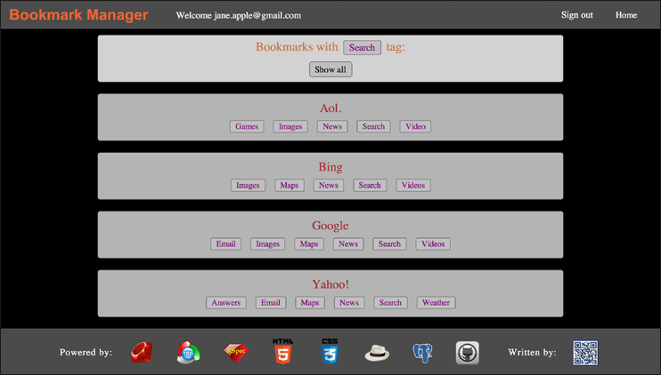

#Bookmark Manager 

## Table of Contents

* [Screenshots](#screenshots)
* [General Description](#general-description)
* [See it Live on Heroku](#see-it-live-on-heroku)
* [Browsers](#browsers)
* [Testing](#testing)
* [License](#license)


##Screenshots

<table>
	<tr>
		<td align="center" width="190px" >
			<a href="https://raw.githubusercontent.com/nadavmatalon/bookmark-manager/master/public/images/app_screenshot_3.png">
				
				 Sign up
			</a>
		</td>
		<td align="center" width="190px" >
			<a href="https://raw.githubusercontent.com/nadavmatalon/bookmark-manager/master/public/images/app_screenshot_1.png">
				
				New bookmark
			</a>
		</td>
		<td align="center" width="190px" >
			<a href="https://raw.githubusercontent.com/nadavmatalon/bookmark-manager/master/public/images/app_screenshot_2.png">
				
				Browse bookmarks
			</a>
		</td>
	</tr>
</table>


##General Description

<p><strong>Bookmark Manager</strong> is a Sinatra web application which enables users 
to create and save a list of links (or 'bookmarks') to various websites, as well as categorize 
and filter them via tags.</p>

<p>At the heart of the app is a postgresql database, while its front-end has been 
created as an exercise in buiding a fully functional Sinatra web application in TDD. 
As such, the app comes with a comprehensive testing suite with integration and feature 
tests for all models and webpages.</p> 

<p>The app includes a user management interface that allows users to sign up,
sign in and sign out. In this context, various validations have been put in place, e.g.
verification of correct email format, email uniqueness, password length, and so forth.</p>

<p>Registered users can add new bookmarks to the list, while un-registered visitors can only 
view its corrent content.</p>

<p>When adding a new bookmark, the user is prompted to provide a url address, a title, as well as
optional tags for indexing purposes.</p>

<p>The list itself can be viewed in its entirety (the defualt), or it can be filtered according
to a specific tag. Both the list itself and the tags are ordered alphabetically.</p>

<p>In visual terms, the site includes a 'sticky' navigation bar at the top, and a 'sticky' footer at
the bottom.</p>


##See it Live on Heroku

A live version of the app can be found at:

http://makers-bookmark-manager.herokuapp.com/

As I'm using Heroku's free hosting service, the app may take a bit of time to upload<br/>
(Heroku's giros take time to wake up...), so please be patient.


##Browsers

This app has been tested with and supports the following browsers:

* __Google Chrome__ (36.0)
* __Apple Safari__ (7.0.5)

The app uses flexbox to display various element, and despite my efforts to make 
it suitable for other browsers as well, it may not look as intended in them.</p>


##  Testing

Tests were written with Rspec (2.14.8) & Capybara (2.3.0)<br>

The tests cover both back-end logic and front-end functionality.

To run the tests in terminal:

```bash
$ rspec
```

##License

<p>Released under the <a href="http://www.opensource.org/licenses/MIT">MIT license</a>.</p>

